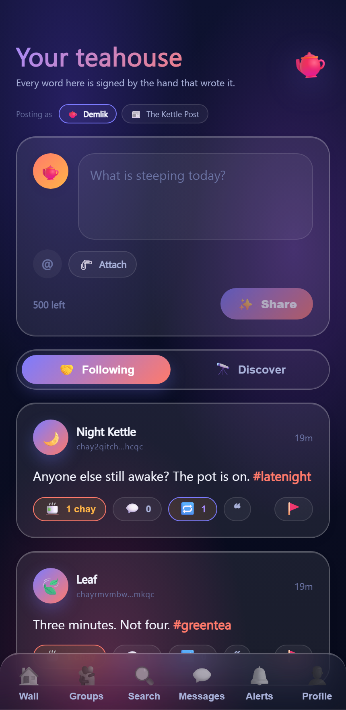
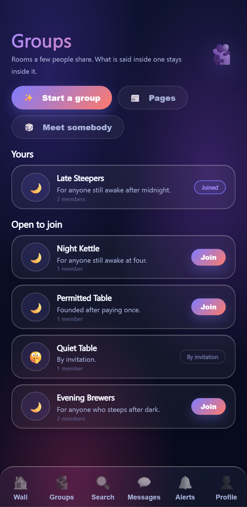
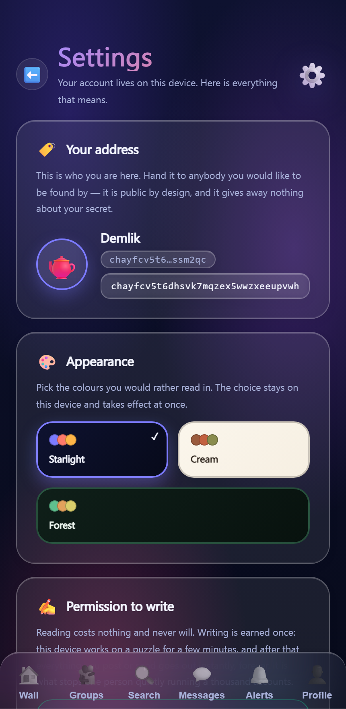
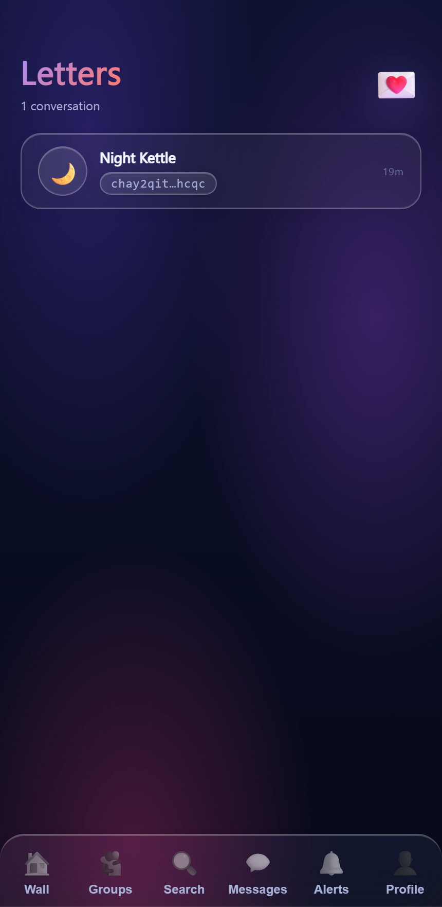
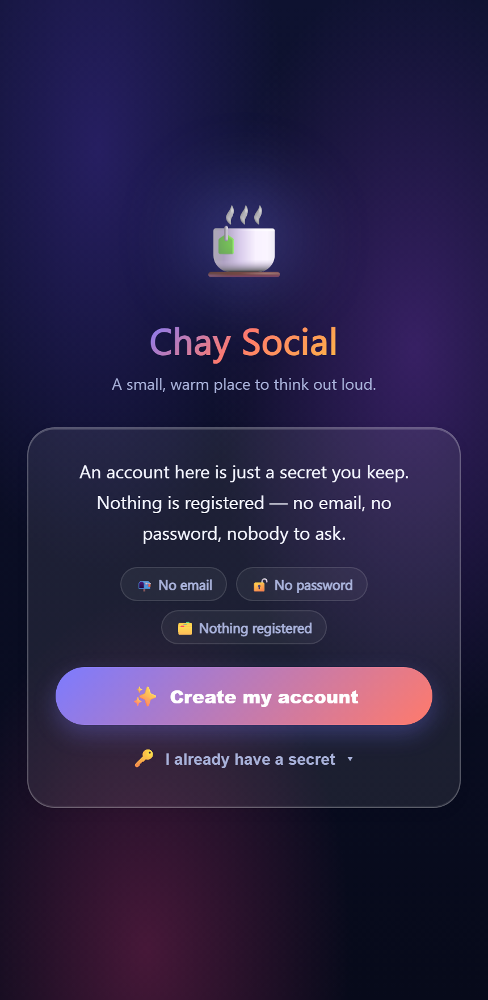

# ChaySocial

[](#status)
[](https://dotnet.microsoft.com/)
[](https://learn.microsoft.com/aspnet/core/blazor/)
[](https://csrc.nist.gov/projects/post-quantum-cryptography)
[](LICENSE)

A social app with no registration. An account is a secret you keep — no email, no password, nothing to
sign up for and nobody to ask. The server stores and serves; it does not hold the keys to anything.

Runs as a Blazor WebAssembly site and as a MAUI Blazor Hybrid app for Windows and Android, from one
shared project.

## Status

**Pre-alpha.** There is no website yet — nothing is deployed anywhere, and there is no address you can visit.
The only way to see it today is to clone the repository and run it locally, as described under
[Building it](#building-it).

Everything below works and has been exercised end to end against a real server with data on disk. None of it
has been through the sort of use that finds the problems only real use finds, so treat it as something to read
and run rather than something to rely on. The storage formats and the signature transcripts are still free to
change without a migration path.

## What it looks like

| Your teahouse | Groups | Settings |
|---|---|---|
|  |  |  |

| Messages | The front door |
|---|---|
|  |  |

Three palettes ship with it — Starlight, Cream and Forest — and the whole app restyles on the next render,
because every colour is a C# value rather than a CSS variable.

---

## What it does

| | |
|---|---|
| **Accounts** | One tap. A 32-byte seed is drawn on the device; every key and the address itself come out of it. Nothing is registered. |
| **Addresses** | Tor-v3 style: `base32(SHAKE256(signing key ‖ encryption key ‖ version))` with a `chay` prefix, so an address *commits to* its keys. |
| **Posts, comments, replies** | Signed on the writer's device. Any reader can check a signature without asking anybody for anything. |
| **Private messages** | End-to-end encrypted. The server holds ciphertext it cannot open. |
| **Read-once messages** | The body lives in a blob the server destroys as it hands it over — claimed by rename, so two requests can never both get it. |
| **Groups** | Rooms whose posts only members can read. |
| **Pages** | A name several people publish under. The page's seed is sealed to each editor's own key, so a post carries the page's signature whoever wrote it. |
| **Meeting strangers** | Two people paired into a room that deletes itself, and everything said in it, the moment either walks out. |
| **Reposts, quotes, chays** | Passing a post on, quoting one, and the app's word for a like. |
| **Mentions and subjects** | `@address` and `#subject`, found by one reader that every kind of text shares. |
| **Tips** | A profile can publish a payment address. Nothing moves through the server — the reader pays from their own wallet. |
| **Reporting** | Posts, accounts, comments and messages. A message report is the only way its words ever reach the server, and only its recipient can file one. |
| **Anonymity** | Refuse anything that is not Tor; carry as many accounts on one device as you like and switch with one tap. |

## The parts worth explaining

### Nobody's secret reaches the server

Signing in is not a password check. The seed produces the same address it always did, and the server is
asked nothing. A challenge–response exists for the cases that need one, and even there the secret never
travels.

### Post-quantum, in pairs

Every asymmetric operation runs two algorithms and combines them, so breaking one is not enough:

| | Classical | Post-quantum |
|---|---|---|
| Signatures | Ed25519 | ML-DSA-65 |
| Key exchange | X25519 | ML-KEM-768 |

Bodies are sealed with ChaCha20-Poly1305; keys are expanded with HKDF-SHA512 and passphrases with Argon2id.
All of it through BouncyCastle, because .NET's own ML-KEM and ML-DSA are bound to the host OS and would not
run in the browser.

### One cost, paid once

Writing needs a permit: a few minutes of the device's own time, once per account, ever. Reading, opening an
account, following and pouring somebody a chay are free and instant.

The difficulty is measured rather than guessed. A browser gets through roughly 1–3 Argon2id attempts a second
at 1 MiB, so nine bits — 512 expected attempts — is about three minutes there. Eleven bits looked reasonable
on paper and measured out at half an hour.

Charging every write was tried first and thrown away: it burnt a second and a half of somebody's phone per
message, paid by everyone who used the app, to inconvenience a farm happy to spend it. Making a thousand
posting accounts expensive is the part worth making expensive.

### Signed where it matters, unsigned where it doesn't

A swapped display name is a cosmetic lie, so profiles are mostly unsigned. A swapped payment address is
theft, so that one field carries its own signature — and since the account address commits to the signing
key, the chain from address to payment address cannot be broken by whoever holds the documents.

## Building it

Needs the .NET 10 SDK. Nothing else — no database to install, no services to configure. Documents and uploaded
media are written to folders beside the app.

```bash
dotnet build ChaySocial.Web/ChaySocial.Web.csproj -t:Compile
```

Run the web app and open `http://localhost:5017`:

```bash
dotnet run --project ChaySocial.Web/ChaySocial.Web.csproj --urls http://localhost:5017
```

Make an account with one tap. To post anything you need a writing permit, which the Settings screen offers and
which takes a few minutes of the machine's own time, once.

Build every target — Windows (x64, x86, arm64), the web app, and Android APKs:

```bash
pwsh ./Publish.ps1
```

Output lands in `Publish/`.

## Layout

```
MainProject/          Everything shared: crypto, identity, data, services, UI
  Cryptography/       The one place an algorithm is chosen
  Identity/           Seeds, addresses, the vault
  Protection/         Proof-of-work and the writing permit
  Persistence/        Typed document store, blob store, local store
  Services/           Wall, messages, groups, pages, moderation, matching
  UI/                 Pages, elements, theme tokens
ChaySocial/           MAUI Blazor Hybrid host (Windows, Android)
ChaySocial.Web/       ASP.NET host, document and blob API, WebAssembly client
Brainstorm/           The idea queue this was built from
LESSONS.md            Problems that were hard, and what fixed them
```

Only C#, Blazor and CSS. No hand-written JavaScript anywhere; browser storage goes through
`Blazored.LocalStorage`. Colours, sizes and timings are C# constants rather than CSS variables, so a theme
swap restyles the app on the next render.

## Not done

Live streaming and voice messages are researched and parked, not forgotten. Both need the camera or the
microphone, and the development browser refuses to open either — `getUserMedia` comes back with
`NotAllowedError`. The packages, their API surface and the chunking approach are written down in
`Brainstorm/Deferred/`, so the work resumes from research already done rather than from scratch.

There is no moderator role, because there is no registration to hang one on. Reports are stored and
tracked; who reads them is the decision of whoever runs the server.

## Licence

MIT. See [LICENSE](LICENSE).
